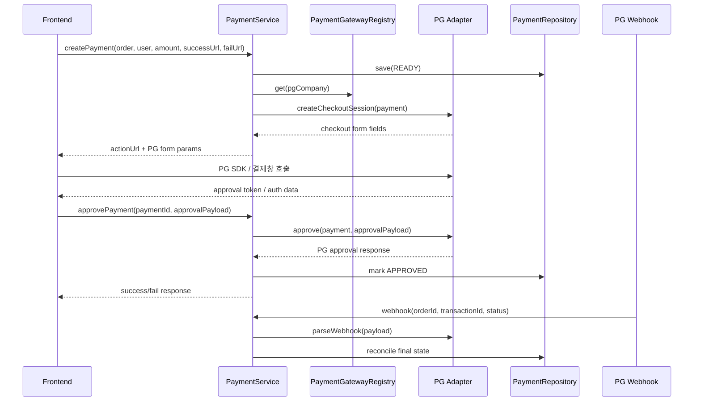

# Architecture

## 의도

이 샘플은 "프론트가 PG 결제창을 띄우고, 백엔드가 승인 API를 다시 호출해 최종 판단하는 구조"를 표현하는 데 초점을 둡니다.

주요 책임은 다음처럼 나뉩니다.

- `PaymentService`: 결제 준비, 승인, 취소, webhook 후속 처리
- `PaymentGateway`: PG사별 전략 계약
- `PaymentGatewayRegistry`: PG 선택 책임 분리
- `KcpPaymentGateway`, `InicisPaymentGateway`, `TossPaymentsGateway`: PG별 요청 포맷과 승인 규칙
- `PaymentRepository`: 주문 기준 결제 상태 저장
- `PaymentEventPublisher`: 후속 발행 포인트 샘플

## 흐름

## 설계 포인트

- 프론트 리다이렉트 URL은 사용자 경험용 경로
- 최종 승인 판단은 백엔드 PG 승인 API 호출 결과 기준
- webhook은 후속 정합성 보강 포인트
- `HttpServletRequest` 같은 웹 객체는 서비스/도메인까지 끌고 내려오지 않음
- PG별 차이는 `PaymentGateway` 구현체 내부 `Map` 필드명과 승인 로직으로 격리

## PG 추가 방법

1. `PgCompany`에 새 PG 값을 추가합니다.
2. `PaymentGateway` 구현체를 추가합니다.
3. `PaymentGatewayRegistry`에 등록합니다.

공통 유스케이스는 그대로 유지됩니다.
