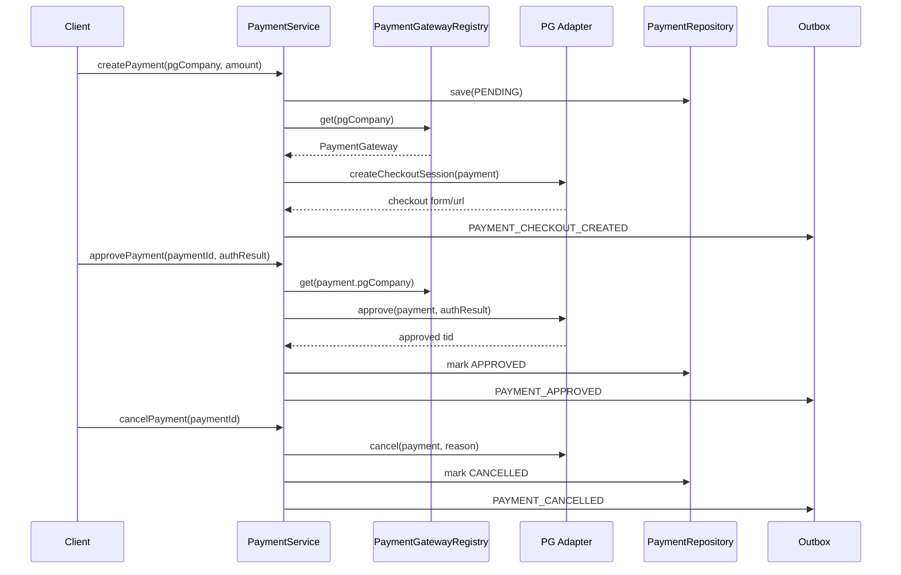

# Architecture

## 기존 구조에서 개선한 점

PDF 기준 기존 결제 구조는 `PaymentInterface`로 공통 계약을 정의했지만, `CreateVerificationPayment`, `CancelVerificationPayment` 같은 도메인 서비스가 `KCPPayment`, `InicisPayment` 구현체를 직접 주입하고 `pgCompany` 값으로 분기했습니다.

이 샘플은 다음 책임을 분리합니다.

- `PaymentService`: 결제 생성, 승인, 취소 유스케이스 처리
- `PaymentGateway`: PG사별 전략 계약
- `PaymentGatewayRegistry`: 요청된 PG사에 맞는 전략 선택
- `KcpPaymentGateway`, `InicisPaymentGateway`: PG사별 요청 포맷, 서명, 승인/취소 처리
- `PaymentRepository`: 결제 상태 저장
- `PaymentEventPublisher`: 결제 이벤트 기록

## 흐름

## PG 추가 방법

1. `PgCompany`에 새 PG 값을 추가합니다.
2. `PaymentGateway` 구현체를 하나 추가합니다.
3. 앱 구성 시 `PaymentGatewayRegistry`에 구현체를 등록합니다.

유스케이스는 `PaymentService`를 수정하지 않아도 됩니다.

